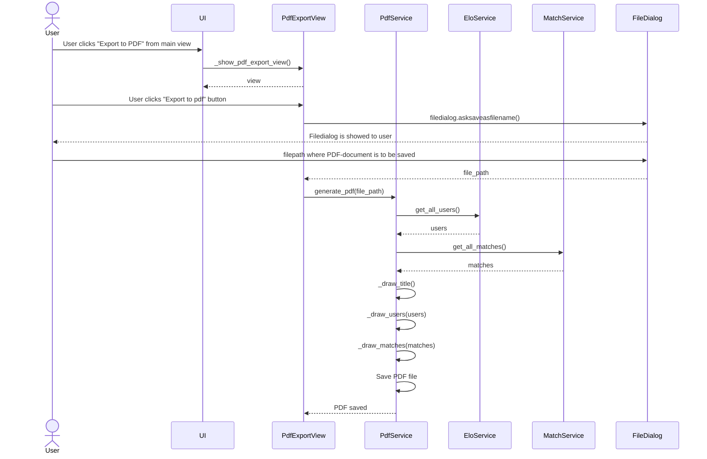
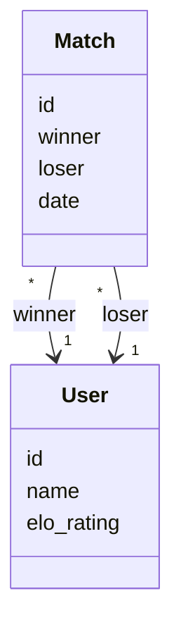

# Arkkitehtuurikuvaus

## Rakenne

Ohjelman rakenne noudattelee kolmitasoista kerrosarkkitehtuuria, jossa on eriteltynä, tämä myös noudattelee repositories tiedonkäsittelyn suunnittelumenetelmää.

Pakkaus ui sisältää käyttöliittymästä, services sovellus/business-logiikasta ja repositories tietojen pysyväistallennuksesta vastaavan koodin. Pakkaus entities sisältää luokkia, jotka kuvastavat sovelluksen käyttämiä tieto-objekteja.

## Käyttöliittymä
Käyttöliittymä sisältää kolme erilaista näkymää:
- Etusivu
- Matsien tallennussivu
- PDF-tiedoston vientisivu

Jokainen näistä näkymistä on toteutettu omana luokkanaan. Näkymät sijaitsevat ´src/ui/views´polussa.

## Päätoiminnallisuuden sekvenssikaavioita

### Sekvenssikaavio uuden käyttäjän luomisesta, olemassaolevaa samannimistä käyttäjää ei ole.

### Sekvenssikaavio PDF-tiedoston exporttaamisesta tietokoneelle

## Sovelluslogiikka

Sovelluksen loogisen tietomallin muodostavat luokat `User` ja `Match`, jotka kuvaavat käyttäjiä ja heidän välisiä FIFA-otteluita:

Sovelluksen toiminnallisista kokonaisuuksista vastaavat luokat `EloService`, `MatchService` ja `PdfService`. Nämä tarjoavat käyttöliittymälle metodeja eri toimintoihin:

**EloService:**
- `create_user(name)`
- `get_all_users()`
- `find_user_by_id(user_id)`
- `find_user_by_username(username)`
- `update_user_elo(user_id, elo)`

**MatchService:**
- `create_match(winner_username, loser_username)`
- `compute_elo_ratings(winner_id, loser_id)`
- `find_match_by_id(id)`
- `get_all_matches()`

**PdfService:**
- `generate_pdf(filepath)`

Luokat pääsevät käsiksi käyttäjiin ja otteluihin tietojen tallennuksesta vastaavan pakkauksessa _repositories_ sijaitsevien luokkien `UserRepository` ja `MatchRepository` kautta. Luokkien toteutukset injektoidaan sovelluslogiikalle konstruktorikutsun yhteydessä.

## Tietojen pysyväistallennus
Pakkauksen repositories luokat `MatchRepository`ja `UserRepository` huolehtivat ohjelman tietojen tallentamisesta. Kummatkin luokat tallentavat tiedot SQLite-tietokantaan. SQLite on pysyväistallenus, eli sovelluksen tiedot pysyvät niin kauan, kunnes .db tiedosto poistetaan tai alustetaan manuaalisesti tietokanta uusiksi.

Luokat noudattavat Repository -suunnittelumallia. Tämä suunnittelumalli mahdollistaa sen, että tulevaisuudessa halutaan vaihtaa sovelluksen datan tallennustapaa, niin se onnistuu suhteellisen helposti.

### Tiedostot

Sovellus tallentaa tiedot database.db nimiseen tiedostoon, joka sijaitsee projektin juuressa.
