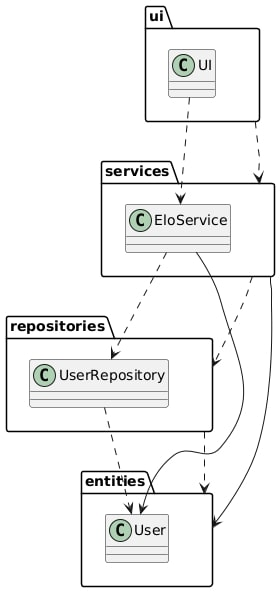
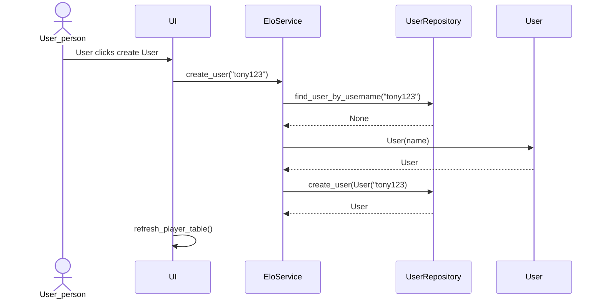

# Arkkitehtuurikuvaus

Sekvenssikaavio käyttäjän luomisesta

## Tietojen pysyväistallennus
Pakkauksen repositories luokat `MatchRepository`ja `UserRepository` huolehtivat ohjelman tietojen tallentamisesta. Kummatkin luokat tallentavat tiedot SQLite-tietokantaan. SQLite on pysyväistallenus, eli sovelluksen tiedot pysyvät niin kauan, kunnes .db tiedosto poistetaan tai alustetaan manuaalisesti tietokanta uusiksi.

Luokat noudattavat Repository -suunnittelumallia. Tämä suunnittelumalli mahdollistaa sen, että tulevaisuudessa halutaan vaihtaa sovelluksen datan tallennustapaa, niin se onnistuu suhteellisen helposti.

### Tiedostot

Sovellus tallentaa tiedot database.db nimiseen tiedostoon, joka sijaitsee projektin juuressa.
