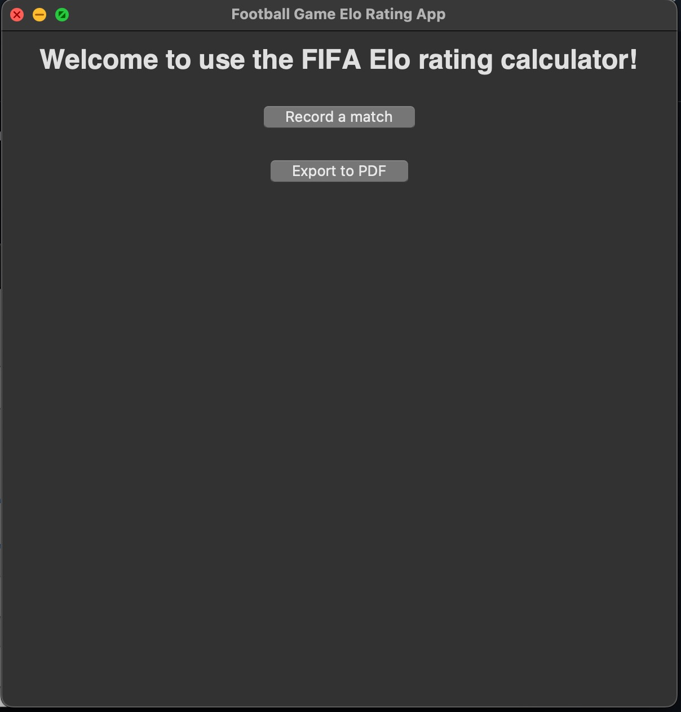
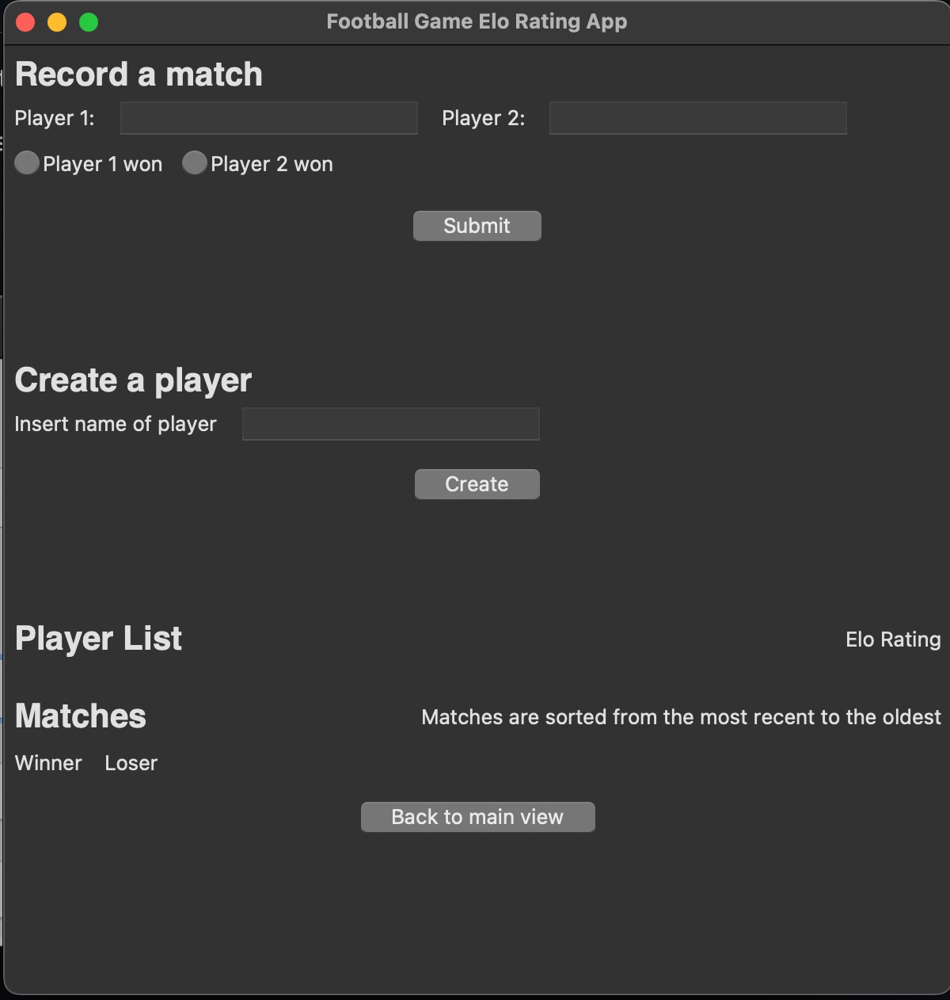
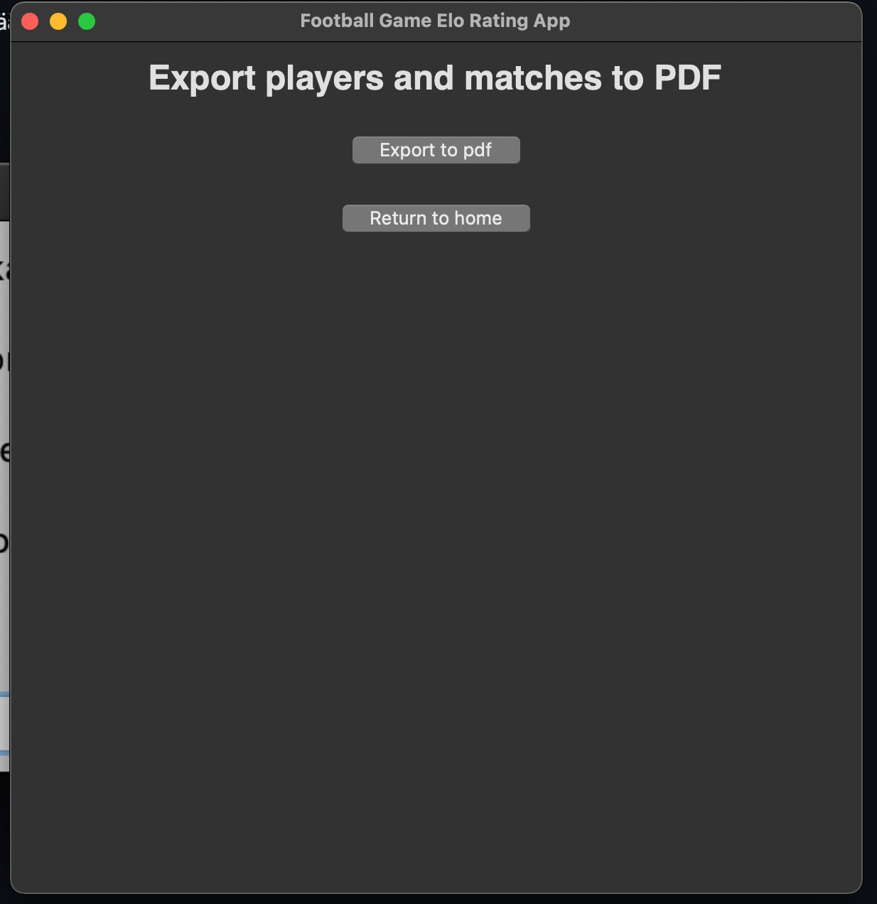
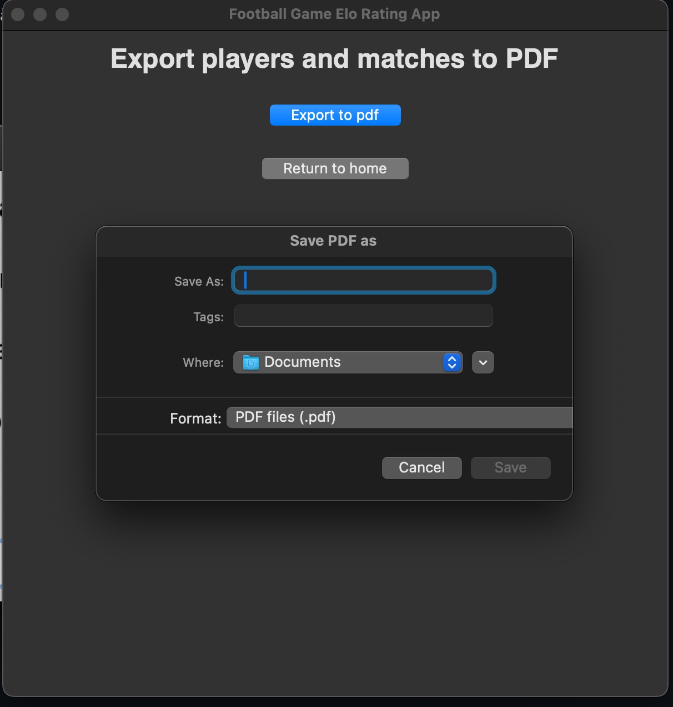

# Käyttöohje

Lataa projektin viimeisimmän [releasen](https://github.com/lamtonylam/ohjelmistotekniikka/releases/) lähdekoodi valitsemalla _Assets_-osion alta _Source code_.


## Ohjelman käynnistäminen

Ennen ohjelman käynnistämistä, asenna riippuvuudet komennolla:

```bash
poetry install
```

Jonka jälkeen suorita alustustoimenpiteet komennolla:

```bash
poetry run invoke build
```

Nyt ohjelman voi käynnistää komennolla:

```
poetry run invoke start
```


## Aloitus
Sovellus käynnistyy alkunäkymään:


Matsin tallentamiseksi, paina nappia "Record a match"
PDF-exporttaukseen, paina nappia "Export to PDF"

## Matsin tallentaminen


Matsin tallentamiseksi, syötä "Player 1" ja "Player 2" tekstikenttiin pelaajien nimet, ja valitse nappulasta kumpi voitti matsin ja paina "submit". Pelaajien nimet eivät saa olla samoja. Jos pelaajia ei ole luotu vielä sovellukseen, matsin tallentaminen hoitaa sen automaattisesti ja luo ne.

Voit halutessasi myös luoda pelaajan manuaalisesti, jolloin ELO-ranking alkaa 1500:sadasta.  
Kirjoita "insert name of player" tekstikenttään pelaajan nimi ja paina "create"

## PDF-tiedoston vienti



PDF-tiedoston vientiin, paina nappia "Export to pdf"



Tämän jälkeen valitse haluamasi tiedostopolku ja vietävälle PDF-tiedostolle tiedostonimi ja paina "save" nappulaa.