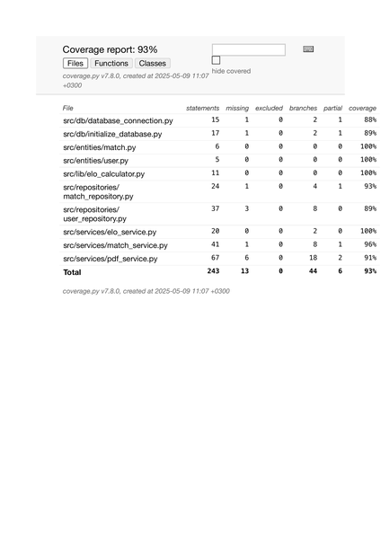

# Testausdokumentti

Ohjelmaa on testattu sekä automatisoiduin yksikkö- ja integraatiotestein unittestilla sekä manuaalisesti tapahtunein järjestelmätason testein.

## Yksikkö- ja integraatiotestaus

### Sovelluslogiikka

Sovelluslogiikasta vastaavia `elo_service.py`, `match_service.py`, `pdf_service` testataan kullekin kuuluvalla testiluokalla. `TestMatches` ja `TestUsers`, `TestPDFGeneration`.

### Repositorio-luokat
Tietokantaoperaatioista vastaavia `match_repository.py` ja `user_repository` testataan integraatiotestaamisella, jossa sovelluslogiikka käyttää repostiroyluokkia.

### Testauskattavuus

Sovelluksen testauksen haarautumakattavuus on:
  

## Järjestelmätestaus
Sovelluksen järjestelmätestaus on suoritettu manuaalisesti.

### Asennus ja konfigurointi
Sovellus on haettu ja sitä on testattu README:n ja käyttöohjeen kuvaamalla tavalla sekä macOS-käyttöjärjestelmällä, että laitoksen  cubbli-virtuaalikoneella.

### Toiminnallisuudet
Kaikki määrittelydokumentin ja käyttöohjeen listaamat toiminnallisuudet on käytä läpi manuaalisessa testauksessa ja varmistettu siitä, ettei yllättäviä bugeja tai ongelmia ilmene.

## Sovellukseen jääneet laatuongelmat
Sovellus ei anna järkeviä virheilmoituksia käyttöliittymässä käyttäjälle, seuraavissa tilanteissa
- jos käyttäjä ohittaa README:ssa esitetyt ohjeet suorittaa `poetry run build`, ei käyttäjälle tule käyttöliittymään järkevää virheilmoitusta.
