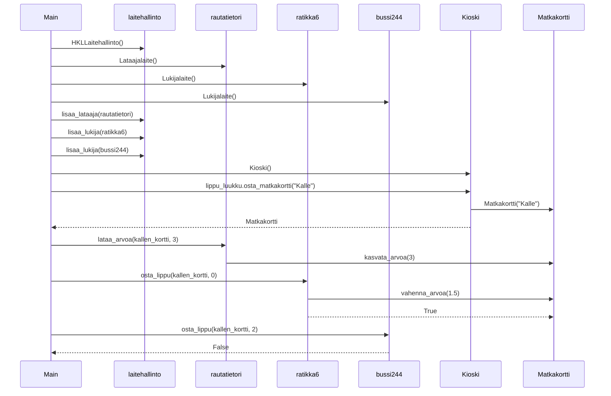

```mermaid
 sequenceDiagram
  Main->>laitehallinto: HKLLaitehallinto()
  Main->>rautatietori: Lataajalaite()
  Main->>ratikka6: Lukijalaite()
  Main->>bussi244: Lukijalaite()

  Main->>laitehallinto: lisaa_lataaja(rautatietori)
  Main->>laitehallinto: lisaa_lukija(ratikka6)
  Main->>laitehallinto: lisaa_lukija(bussi244)

  Main ->> Kioski: Kioski()
  Main ->> Kioski:lippu_luukku.osta_matkakortti("Kalle")
  Kioski ->> Matkakortti: Matkakortti("Kalle")
  Kioski -->> Main: Matkakortti

  Main ->> rautatietori: lataa_arvoa(kallen_kortti, 3)
  rautatietori ->> Matkakortti: kasvata_arvoa(3)

  Main ->> ratikka6: osta_lippu(kallen_kortti, 0)
  ratikka6 ->> Matkakortti:vahenna_arvoa(1.5)
  ratikka6 -->> Matkakortti: True


  Main ->> bussi244: osta_lippu(kallen_kortti, 2)
  bussi244 -->> Main: False
```